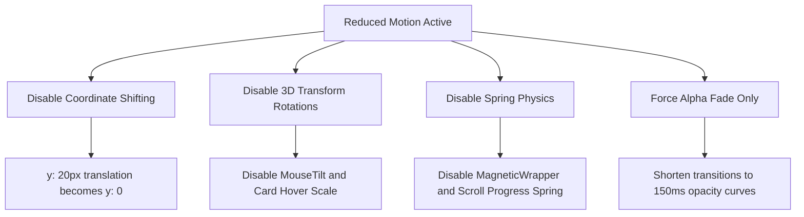

# Motion & Interaction System Specification

This document details the motion philosophy, timing scales, component interactions, and performance parameters that define the visual dynamics of Enosh Jaques' digital identity.

---

## 1. Motion Philosophy

Our motion principles ensure that animations never exist for decoration alone. Every transition, hover state, or reveal must justify its presence by improving visitor comprehension, hierarchy, or interaction.

- **Motion Explains**: Introduces structural spatial relationships (e.g., expanding dropdowns or revealing timeline stages).
- **Motion Guides**: Draws focus to primary calls to action (CTAs) and guides eye movement down the reading layout.
- **Motion Rewards**: Provides subtle micro-feedback on click or hover states to make the interface feel responsive and alive.
- **Motion Never Distracts**: Bypasses heavy screen-wide sweeps, bouncing entries, and high-frequency noise.
- **Motion Never Delays**: Runs at speeds that match high-performance hardware, ensuring pages feel fast and responsive.

---

## 2. Motion Timing Table

We use a standard set of timing constants and spring constants to ensure visual consistency across the entire website:

| Animation Type               | Duration | Easing Curve / Spring Values             | Rationale                                              |
| :--------------------------- | :------- | :--------------------------------------- | :----------------------------------------------------- |
| **Page Transition**          | `0.4s`   | `[0.16, 1, 0.3, 1]` (easeOutExpo)        | Subtle initial entry fade and slight translation.      |
| **Component Entry (FadeUp)** | `0.6s`   | `[0.16, 1, 0.3, 1]` (easeOutExpo)        | Smooth upward reveal (y: 20px &rarr; 0) when scrolled. |
| **Dropdown Toggle**          | `0.15s`  | `easeOut` (linear-to-slow curve)         | Instant popover layout opening.                        |
| **Button / Badge Hover**     | `0.2s`   | `easeOut`                                | Subtle scale adjustment and color transition.          |
| **Interactive Tilt (3D)**    | Dynamic  | `stiffness: 200, damping: 25`            | Spring damping prevents rapid oscillations.            |
| **Magnetic Attraction**      | Dynamic  | `stiffness: 150, damping: 15, mass: 0.1` | Bouncy attraction that snaps back instantly.           |

---

## 3. Interaction Inventory

### 3.1 Global & Layout Motion

- **Initial Page Load**: Fades layout elements and shifts them up by 8px.
- **Route Transitions**: Handled by `template.tsx`. Performs a subtle fade-in combined with an 8px vertical offset to avoid cumulative layout shift.
- **Scroll Progress Indicator**: Thin `2px` cyan line pinned at the top viewport. Scaled via hardware-accelerated CSS `transform: scaleX` directly, completely avoiding layout reflows or component re-renders.
- **Sticky Header Transition**: Translucent backing blurs and borders fade in only after the page is scrolled past `20px` to keep loading views light.

### 3.2 Component Reveals (On-Scroll)

- **Hero Section**: Revealing headlines and titles immediately using standard fade up settings.
- **Timeline Nodes**: Timeline vertical line remains static; individual timeline card components fade in and translate upward by 10px one by one as they enter the viewport, preventing cognitive overload.
- **Portfolio & Project Cards**: Reveal sequentially using a stagger animation container (`delayChildren: 0.08s` intervals).

### 3.3 Interactive Desktop Feedback (Mouse Only)

- **Buttons**:
  - Scale up to `102%` on hover.
  - Scale down to `98%` on click.
  - Subtle hover color changes (e.g. electric teal brightens slightly).
- **Cards (Project / Service)**:
  - Scale up to `101.5%` on hover.
  - Border color changes from muted grey to standard white/[0.15] to highlight interaction boundaries.
- **Images & Mockups**:
  - Images scale up to `105%` inside their boundaries.
  - Photography preview details (camera settings) fade up from the bottom when hovered.
- **Magnetic Elements**: Primary CTA buttons track cursor offsets up to `15px` maximum, snapping back to center immediately on mouse leave.
- **3D Card Tilt**: Applied to select highlight cards (e.g., FinCalc showcase). Tilts the card slightly (up to `8 degrees` maximum) based on relative cursor coordinates.

---

## 4. Reduced-Motion Specification (a11y)

When `prefers-reduced-motion: reduce` is active on the user's system, the motion system enforces the following overrides:

### Reduced-Motion Override Matrix

| Interactive Component | Standard Behavior                           | Reduced-Motion Override                     |
| :-------------------- | :------------------------------------------ | :------------------------------------------ |
| **Page Transitions**  | `opacity` + `y: 8px` translation            | `opacity` fade only (no translation offset) |
| **Entrance Reveals**  | `opacity` + `y: 20px` translation           | `opacity` fade only                         |
| **Cursor Glow**       | Follows mouse coordinates with ambient blur | Completely hidden (`display: none`)         |
| **3D Card Tilt**      | Mouse-coordinated 3D tilt matrices          | Disabled (remains static)                   |
| **Magnetic Wrapper**  | Snaps to cursor location                    | Disabled (remains static)                   |
| **Background Glows**  | Floating and rotating ambient blur vectors  | Static positions (animations disabled)      |
| **Image Hover Zoom**  | Image scale jumps to `105%` on card hover   | Static (scale locked to `100%`)             |

---

## 5. Animation Performance Review (GPU Compositing)

To achieve a consistent 60fps scrolling experience, animations follow strict browser rendering guidelines:

- **GPU Accelerable Properties Only**: We restrict transforms to `transform: translate3d()`, `scale()`, and `opacity`. This ensures that animations run on the compositor thread without triggering the layout or paint pipelines on the CPU.
- **No Layout Property Animations**: We do not animate properties that trigger layout recalculation (such as `width`, `height`, `margin`, `padding`, or `top/left/bottom/right`).
- **Restrained backdrop-filters**: Desktop blur values are locked to `backdrop-blur-md` (8px). On mobile devices, backdrop filters are completely disabled using CSS media queries to prevent GPU bottlenecking, falling back to flat translucent background colors.
- **No Shadow Animation**: Large box-shadow animations are paint-heavy. We highlight card hover states using border-color transitions and scales instead of scaling box shadows.

---

## 6. Component Specification Mapping

### 6.1 Components Requiring Motion

- **Button** (`Button.tsx`): Hover scale, tap scale, loading spin loop.
- **Cards** (`Cards.tsx`): Hover boundary focus, on-scroll entrance.
- **Header / Dropdowns** (`Header.tsx`): Popover fade-ups, scroll height transitions.
- **Mobile Drawer**: Slide-in transitions from right screen boundary.
- **ScrollProgress**: Smooth horizontal width updates on page scroll.
- **MotionWrappers** (`MotionWrappers.tsx`): Staggered containers, reveals, magnetic forces.

### 6.2 Components Intentionally Left Static

- **Typography Elements** (`Typography.tsx`): Heading, body, and quotes must remain static to prevent visual shaking or layout shift during text rendering.
- **Section Containers & Dividers** (`Sections.tsx`): Borders and divider lines must remain static to preserve clean structural margins.
- **Brand Monogram Logo**: The vector EJ logo mark remains static to anchor the top-left coordinate space.

---

## 7. Visual Testing Matrix

We test the responsive performance of animations across the following configurations:

- **320px & 390px (Mobile)**:
  - Verify `backdrop-filter` is disabled.
  - Verify 3D Tilt and Magnetic elements are deactivated.
  - Verify swipe and drawer actions work smoothly.
- **768px (Tablet)**:
  - Confirm drawer opens and locks background page scroll.
  - Confirm cards wrap naturally without entry overlaps.
- **1024px, 1440px, & 4K (Desktop & Ultra-wide)**:
  - Confirm cursor glows follow pointer accurately.
  - Verify magnetic buttons attract cleanly and snap back.
  - Verify scroll progress line reaches 100% at the bottom of the page.
- **Keyboard Navigation**:
  - Confirm active page dropdown items can be selected using the keyboard.
  - Verify the cursor glow disappears when tabbing to prevent focus distraction.
